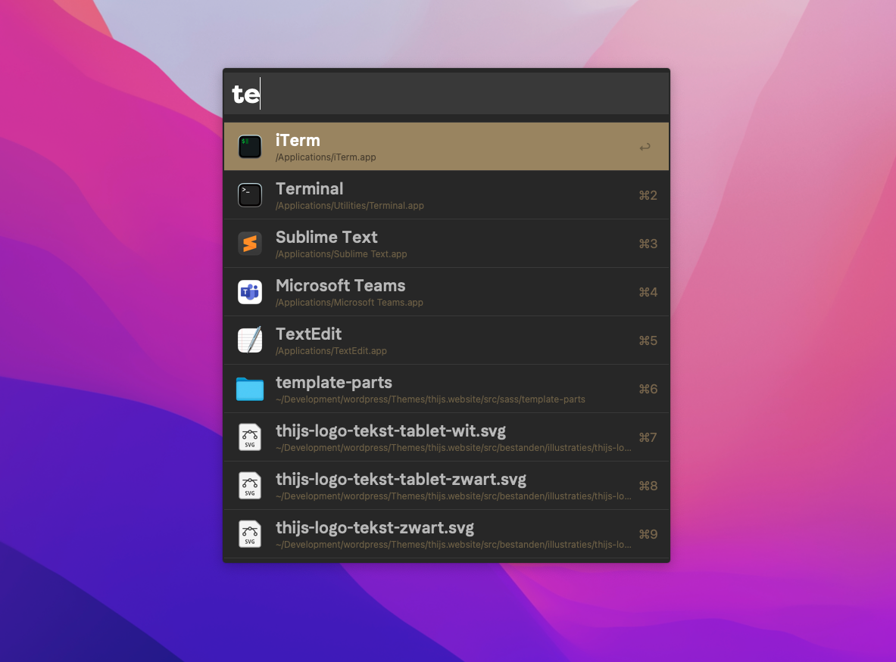

# Drops of Gold Theme for Alfred

Drops of Gold Theme for Alfred is a professional Alfred color-scheme for maximum productivity. 

 

⚠️ **Be aware, I know longer maintain this repo.**
 

## How to install

1. Download [`Drops of Gold.alfredappearance`] or [`Drops with more Gold.alfredappearance`] — just click this link and Press <kbd>Cmd/Ctrl</kbd> + <kbd>S</kbd> to save it as is on your system. Make sure the extension remains `.alfredappearance`
2. Double click to open it in Alfred, it will ask you to confirm the import. Do that.
3. Done!!!

## Changelog

[❯ Read the changelog here →](changelog.md)

## Use of Fonts

I personally use Brandon Text for my sans font. Unfortunately, it's a paid font, so I can't include it here. [For $35 dollars you can purchase it yourself.](https://www.myfonts.com/collections/brandon-text-font-hvd-fonts)

The More Gold version uses also my title font, [which is Filson Pro.](https://fonts.adobe.com/fonts/filson)

 

## Reporting bugs

If you find an issue, [let me know here on Github](https://github.com/thijswillemmoens/drops-of-gold-alfred/issues/new).
 

### Contributions

Anyone is welcome to contribute to this Alfred app Theme.

There are various ways you can contribute:

-   [Raise an issue](https://github.com/thijswillemmoens/drops-of-gold-alfred/issues) on GitHub.
-   Send me a Pull Request with your bug fixes and/or new features.

## Sponsor

Enjoy my Open Source and free work and [don't forget to tip the waiter.](https://github.com/thijswillemmoens/sponsor) ☕

    
&nbsp;<small> Follow me on Twitter</small>

    
&nbsp;<small>Check out my website with interessting articles</small>

    
&nbsp;<small>Connect on LinkedIn</small>

